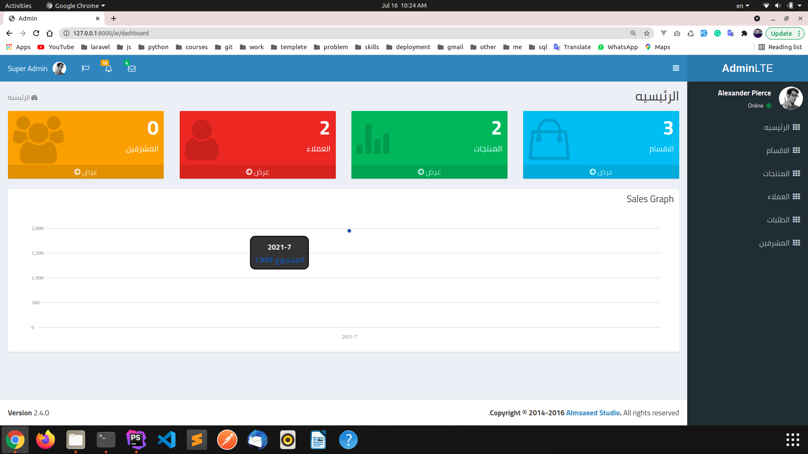
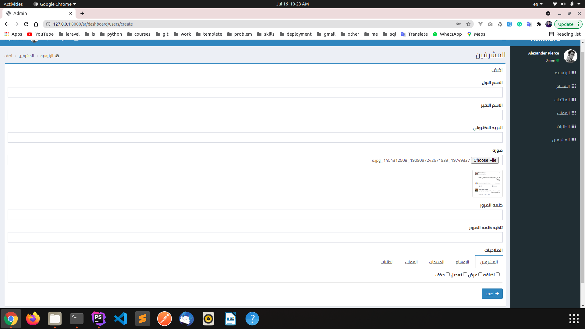
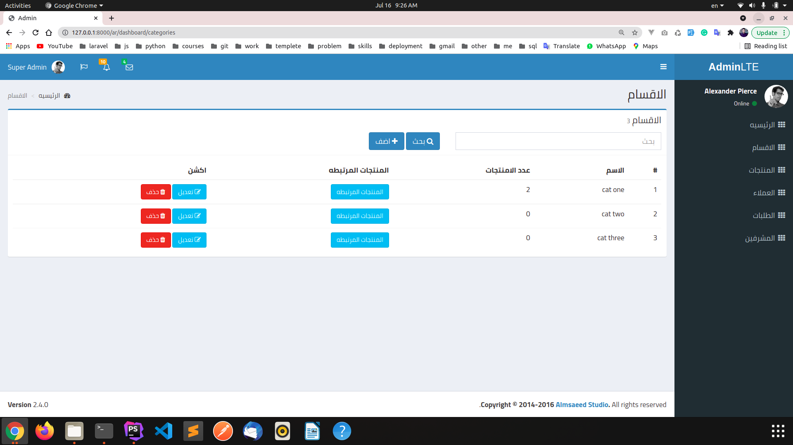
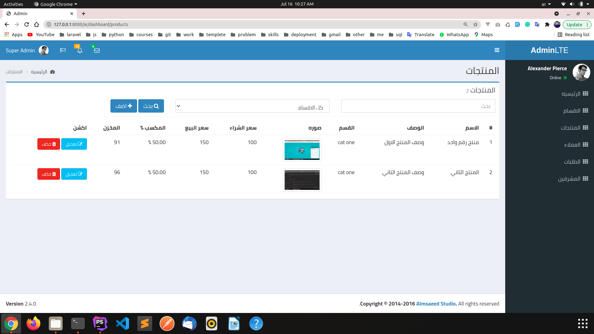
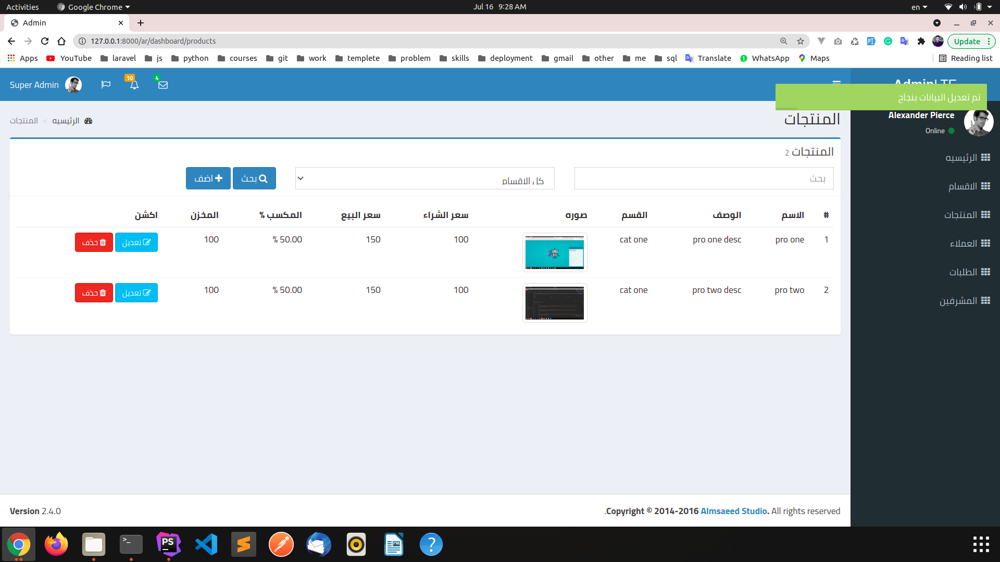
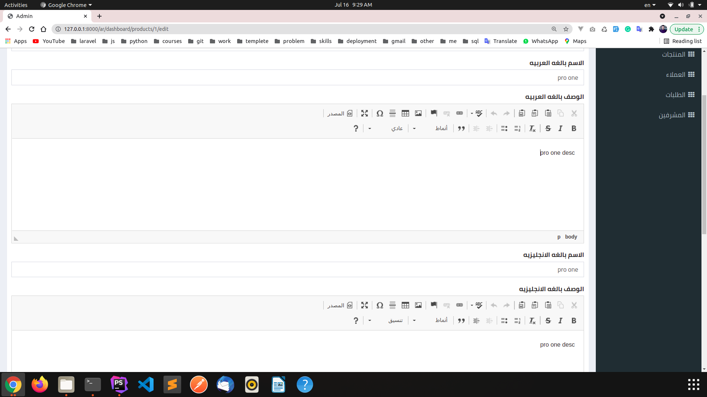
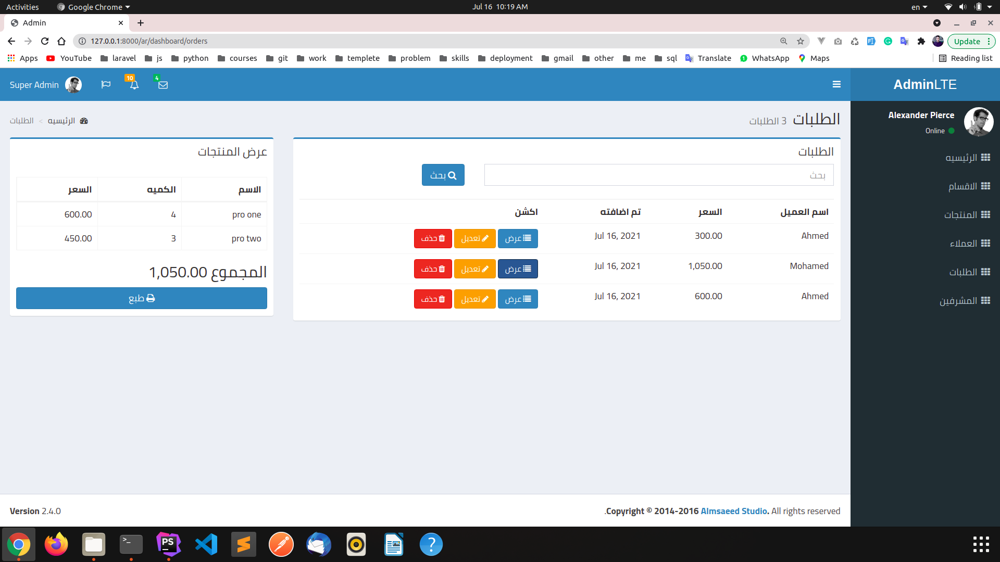
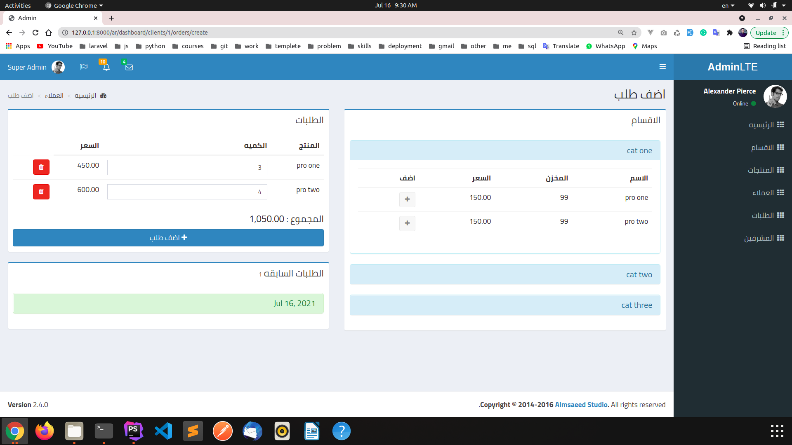

            #Point OF Sale

Hello...

Point Of Sale (POS) is designed to help small businesses with keeping track of customers,with multi-language and permission

To run project

1- php artisan migrate:fresh --seed

2- in localhost

    - php artisan serve

To Browse Website

    goto -> http://127.0.0.1:8000

#home page

#Add Admin with Permission

#Show categories  

#Show ar products 

#Show en products

#Edit products

#Show Orders

#Add Order

